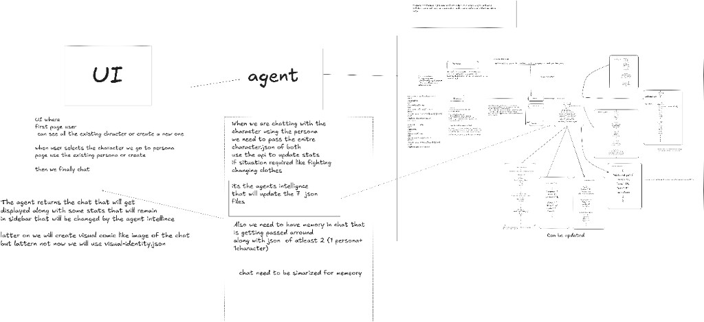

# Narrative Engine

File-based character and persona engine. Each character lives in `World/Characters/{Name}/` and each persona lives in `World/Persona/{Name}/`. `character.json` is the hub in both folders; the backend combines, creates, and updates those files.

## Architecture

**Version:** v3 architecture



## APIs

Run the backend from `backend/narrative-engine` with `.\mvnw quarkus:dev`. Base URL: `http://localhost:8080`.

`{class}` must be `mage` or `melee` (`melle` is accepted as melee). Character and persona names are unique within their own folder, not across both.

### Characters

| Method | URL | Purpose |
|---|---|---|
| GET | `/characters` | Names of character folders under `World/Characters/` |
| GET | `/characters/{name}` | Combined character JSON |
| POST | `/create_new_character/{name}/{class}` | Create folder and JSON files from mage or melee defaults under `World/Characters/` |
| PUT | `/update_character/{name}` | Merge fields into existing character JSON |

### Personas

Same JSON shape as characters. Files are stored under `World/Persona/`.

| Method | URL | Purpose |
|---|---|---|
| GET | `/personas` | Names of persona folders under `World/Persona/` |
| GET | `/personas/{name}` | Combined persona JSON |
| POST | `/create_new_persona/{name}/{class}` | Create folder and JSON files from mage or melee defaults under `World/Persona/` |
| PUT | `/update_persona/{name}` | Merge fields into existing persona JSON |

Authoring notes for the JSON files are in [NOTES.md](NOTES.md).

## Frontend

The Angular app in `frontend` walks character → persona → chat.

1. Start the backend from `backend/narrative-engine` with `mvn quarkus:dev`.
2. In another terminal, start the UI:

```powershell
cd frontend
npm.cmd start
```

Open `http://localhost:4200`. The UI proxies world APIs to `http://localhost:8080` and chat to the Python agent at `http://localhost:8000`.

## Agent

The FastAPI + LangGraph service in `agent` turns chat into an OpenAI reply and may call Quarkus tools to update Character/Persona JSON.

```powershell
cd agent
python -m venv .venv
.\.venv\Scripts\Activate.ps1
pip install -r requirements.txt
copy .env.example .env
uvicorn app:app --reload --port 8000
```

Set `OPENAI_API_KEY` in `agent/.env`. Keep Quarkus running on port 8080.
